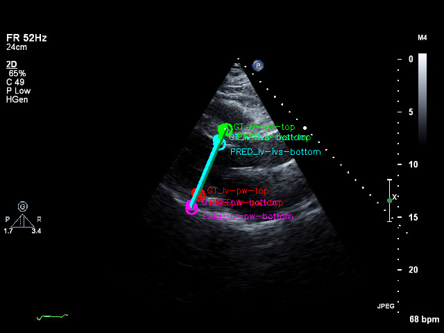
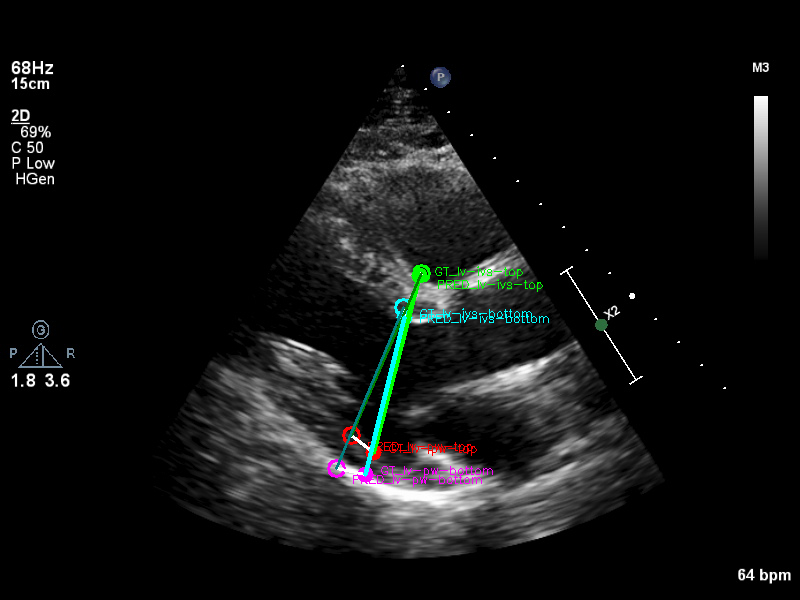

# LV Diastolic Diameter Point Detection

This project implements a **Swin Transformer-based** deep learning model for automatically detecting Left Ventricular (LV) diastolic diameter measurement points in cardiac ultrasound images.

## 📋 Overview

The model detects 4 key anatomical landmarks required for LV diastolic diameter measurement:
- **lv-ivs-top**: Top of interventricular septum
- **lv-ivs-bottom**: Bottom of interventricular septum  
- **lv-pw-top**: Top of posterior wall
- **lv-pw-bottom**: Bottom of posterior wall

## 🏗️ Model Architecture

### Backbone: Swin Transformer
- **Model**: `microsoft/swin-tiny-patch4-window7-224`
- **Input**: 224×224 RGB images
- **Output**: 4 landmark points (8 coordinates)

### Architecture Details
- **Feature Extraction**: Swin Transformer with hierarchical feature maps
- **Regression Head**: 
  - Global Average Pooling
  - FC layers: 768 → 512 → 256 → 8 (4 points × 2 coordinates)
  - ReLU activation + Dropout for regularization
- **Loss Function**: MSE Loss on normalized coordinates
- **Optimizer**: AdamW with Cosine Annealing LR scheduler

## 📁 Project Structure

```
15_point_detection/
├── data_prep_lvdiast.py     # Data preparation script
├── train.py                 # Training script
├── test.py                  # Testing and evaluation script
├── Dockerfile              # Docker configuration
├── requirements.txt        # Python dependencies
├── Readme.md               # This file
│
├── docs/                   # Documentation images
│   ├── result_example_1.png # Example result visualization
│   └── result_example_2.png # Example result visualization
│
├── labels/                 # Original label files (required)
│   ├── labels-all.json     # All annotations
│   ├── labels-train.json   # Training set labels
│   ├── labels-val.json     # Validation set labels
│   └── labels-test.json    # Test set labels
│
├── png-cache/              # Original images (required)
│   └── 01/                 # Image directory structure
│       ├── 00/, 01/, ...   # Subdirectories with images
│
├── lv_diast_data/          # Processed dataset (created by data_prep)
│   ├── images/
│   │   ├── train/          # Training images
│   │   ├── val/            # Validation images
│   │   └── test/           # Test images
│   └── images_with_labels/ # Images with landmarks visualized
│
├── lv_diast_labels/        # Processed labels (created by data_prep)
│   ├── train_labels.json   # Training labels
│   ├── val_labels.json     # Validation labels
│   ├── test_labels.json    # Test labels
│   ├── simple_labels.json  # Simplified label format
│   └── dataset_stats.json  # Dataset statistics
│
├── test_results/           # Test results (created by test.py)
│   ├── test_000_image1.png # Visualization images
│   ├── test_001_image2.png
│   └── measurement_comparison.png
│
├── best_model.pth          # Trained model weights
└── training_curves.png     # Training loss curves
```

## 🚀 Quick Start

### 1. Prepare Your Data

**Required Input Structure:**
```
your_project/
├── labels/
│   └── labels-all.json     # JSON file with image annotations
└── png-cache/
    └── 01/                 # Directory containing your images
        ├── 00/, 01/, ...   # Subdirectories with PNG images
```

The `labels-all.json` should contain annotations in this format:
```json
{
  "image_name.png": {
    "labels": {
      "lv-ivs-top": {"type": "point", "x": 123.4, "y": 56.7},
      "lv-ivs-bottom": {"type": "point", "x": 125.1, "y": 89.2},
      "lv-pw-top": {"type": "point", "x": 200.3, "y": 58.1},
      "lv-pw-bottom": {"type": "point", "x": 198.9, "y": 91.5}
    }
  }
}
```

### 2. Build Docker Image

```bash
docker build -t lv-detection .
```

### 3. Data Preparation

This step processes your raw data and creates train/val/test splits:

```bash
docker run --rm -v $(pwd):/icardio lv-detection python data_prep_lvdiast.py
```

**Output:**
- Creates `lv_diast_data/` with organized image splits
- Creates `lv_diast_labels/` with processed labels
- Generates visualized images in `lv_diast_data/images_with_labels/`
- Produces dataset statistics in `lv_diast_labels/dataset_stats.json`

### 4. Train Model

```bash
# Basic training
docker run --rm --gpus all --shm-size=8g -v $(pwd):/icardio lv-detection python train.py --pretrained

# Custom parameters
docker run --rm --gpus all --shm-size=8g -v $(pwd):/icardio lv-detection python train.py \
    --batch_size 32 \
    --num_epochs 150 \
    --image_size 224 \
    --pretrained
```

**Training Parameters:**
- `--data_dir`: Data directory (default: `/icardio/lv_diast_data`)
- `--labels_dir`: Labels directory (default: `/icardio/lv_diast_labels`)
- `--batch_size`: Batch size (default: 16)
- `--num_epochs`: Number of epochs (default: 100)
- `--image_size`: Input image size (default: 224)
- `--pretrained`: Use pretrained Swin model (recommended)
- `--device`: Device to use (default: cuda)

**Training Output:**
- `best_model.pth`: Best model weights based on validation loss
- `training_curves.png`: Training and validation loss curves

> **Note**: The trained model file (`best_model.pth`) is not included in this repository due to its large size (>300MB). You will need to train the model yourself using the provided training script.

### 5. Test Model

```bash
docker run --rm --gpus all --shm-size=8g -v $(pwd):/icardio lv-detection python test.py \
    --model_path best_model.pth \
    --save_dir test_results
```

**Test Parameters:**
- `--model_path`: Path to trained model (default: `best_model.pth`)
- `--save_dir`: Directory to save results (default: `test_results`)

## 📊 Results and Evaluation

### Example Results

The model successfully detects LV diastolic diameter measurement points on cardiac ultrasound images:


*Example 1: Model predictions (empty circles) vs ground truth (filled circles) with diameter measurements*

  
*Example 2: Accurate landmark detection with connecting lines showing prediction errors*

**Legend:**
- 🟢 **Green**: lv-ivs-top (top of interventricular septum)
- 🟡 **Yellow**: lv-ivs-bottom (bottom of interventricular septum)  
- 🔵 **Blue**: lv-pw-top (top of posterior wall)
- 🟣 **Magenta**: lv-pw-bottom (bottom of posterior wall)
- **Filled circles**: Ground truth landmarks
- **Empty circles**: Model predictions
- **White lines**: Error vectors between GT and predictions
- **Colored lines**: Diameter measurements (thick=GT, thin=predicted)

### Test Output

The test script generates comprehensive evaluation results:

1. **Console Output:**
   ```
   Point-wise MSE (in normalized coordinates):
   lv-ivs-top     : MSE_x=0.001234, MSE_y=0.002345, Total=0.001789
   lv-ivs-bottom  : MSE_x=0.001456, MSE_y=0.002567, Total=0.002011
   ...
   
   Measurement MSE (in pixels):
   Top diameter:    45.67 pixels²
   Bottom diameter: 52.34 pixels²
   Average diameter: 48.99 pixels²
   
   Measurement RMSE (in pixels):
   Top diameter:    6.76 pixels
   Bottom diameter: 7.23 pixels
   Average diameter: 7.00 pixels
   ```

2. **Visualization Images** (saved to `test_results/`):
   - `test_000_image1.png`, `test_001_image2.png`, etc.
   - Each image shows:
     - **Filled circles**: Ground truth landmarks
     - **Empty circles**: Predicted landmarks  
     - **White lines**: Connecting GT and predictions
     - **Colored lines**: Diameter measurements (GT vs predicted)

3. **Measurement Comparison Plot**:
   - `measurement_comparison.png`: Scatter plots comparing predicted vs ground truth measurements
   - Shows correlation between predicted and actual diameter measurements

### Understanding the Results

- **Point-wise MSE**: Measures accuracy of individual landmark detection
- **Measurement RMSE**: Measures accuracy of diameter calculations in pixels
- **Visualization**: Visual assessment of model performance on individual images

## 🔧 Troubleshooting

### Common Issues

1. **GPU Memory Error**: Reduce `--batch_size` (try 8 or 4)
2. **Shared Memory Error**: Increase `--shm-size` or set `num_workers=0`
3. **Model File Too Large**: The `.gitignore` excludes `*.pth` files from git (models are >300MB)
4. **Missing Trained Model**: Train the model first using the training script - pre-trained models are not provided due to file size
5. **Missing Data**: Ensure `labels/` and `png-cache/` directories are present

### Performance Tips

- Use `--pretrained` for better results
- Increase `--num_epochs` for better convergence (150-200)
- Monitor training curves in `training_curves.png`
- Check `dataset_stats.json` for data distribution

## 📋 Requirements

- Docker with GPU support (NVIDIA Container Toolkit)
- CUDA-compatible GPU (recommended)
- At least 8GB GPU memory for training
- Input images in PNG format
- Annotations in the specified JSON format

## 🎯 Expected Performance

With the Swin Transformer model, you can expect:
- **Point Detection RMSE**: ~5-10 pixels for good quality images
- **Diameter Measurement RMSE**: ~5-15 pixels depending on image quality
- **Training Time**: ~2-4 hours for 100 epochs (depending on dataset size and GPU)